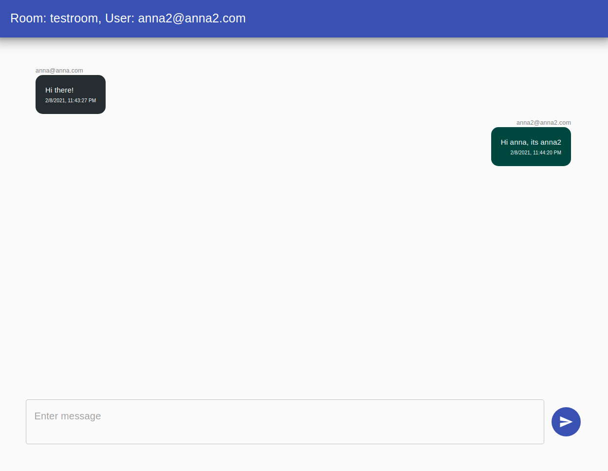

# Twilio Programmable Chat and React App

[Blog article sample](https://www.twilio.com/blog/build-a-chat-app-with-twilio-programmable-chat-and-react)

[Github repo for sample app](https://github.com/huzaima/react-twilio-chat) 

### Frontend
React App with following components

- welcome screen
- chat screen
- chat item
- router

 

### Backend
- [backend quick start](https://github.com/TwilioDevEd/sdk-starter-node) -> Twilio SKD starter application for Node.js

 

### Connection to our project
This can be used to have easy, quick chats between coordinators and volunteers. 

Possible things to add:
- auto pilot responder
- real chat, have responses that are pre made that can easily be sent in after a message

 

